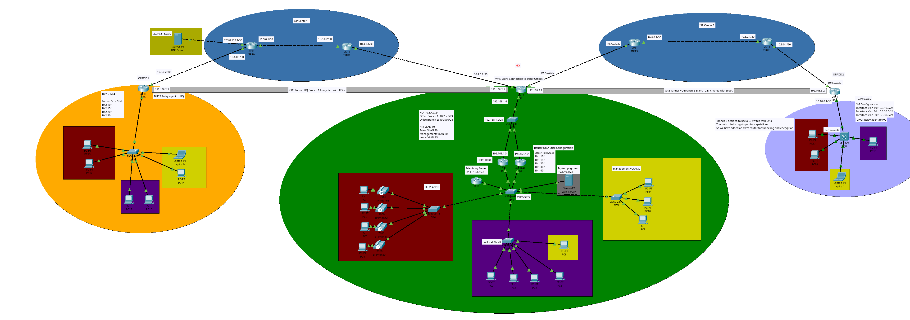

## Multi Site Network Simulation ## 

### About This Project ###
A 3-site enterprise WAN built in Cisco Packet Tracer: a Headquarters office and two branch offices connected across a simulated ISP backbone via redundant, encrypted GRE-over-IPsec tunnels, with centralized DHCP, HSRP gateway redundancy, inter-VLAN routing, and an on-site VoIP deployment.
# Multi-Site Network Simulation
 
## Contents
 
- [Overview](#overview)
- [Site Summary](#site-summary)
- [Topology](#topology)
- [IP Addressing Plan](#ip-addressing-plan)
- [WAN Links](#wan-links)
- [Routing (OSPF)](#routing-ospf)
- [Site-to-Site VPN (GRE over IPsec)](#site-to-site-vpn-gre-over-ipsec)
- [High Availability](#high-availability)
- [VLANs & Switching](#vlans--switching)
- [DHCP](#dhcp)
- [Voice / VoIP](#voice--voip)
- [Servers](#servers)
- [Device Inventory](#device-inventory)
- [Design Notes & Known Quirks](#design-notes--known-quirks)
- [Repository Structure](#repository-structure)
## Overview
 
The lab models a company with a Headquarters (HQ) site and two branch offices ("Office 1" and "Office 2"), tied together over a simulated public internet made of four transit routers ("ISP Center 1" and "ISP Center 2"). Each branch reaches HQ over a GRE tunnel wrapped in IPsec, with a single OSPF process (area 0) run consistently across LAN, WAN, and tunnel interfaces so that end-to-end reachability, tunnel-preference, and failover all fall out of the same routing design.
 
Key characteristics:
 
- **51 simulated devices**: routers, switches, an L3 industrial switch, servers, PCs, laptops, IP phones, and rack power distribution units.
- **Two branch designs side by side, deliberately different**: Office 1 uses classic router-on-a-stick sub-interfaces; Office 2 uses an L3 switch with SVIs (an explicit design choice called out on the topology diagram itself) paired with a dedicated router purely to terminate the IPsec tunnel, since the switch hardware can't do crypto.
- **Centralized DHCP** for all three sites' data VLANs, served from HQ using a split-scope pair for redundancy.
- **HSRP** dual gateways at HQ, with the standby router carrying an identical DHCP configuration so it can take over completely on failover.
- **A working Cisco CME (Call Manager Express) voice deployment** at HQ with four IP phones and four extensions.
- **OSPF cost tuning** on the WAN links to keep LAN-to-LAN traffic on the encrypted tunnels instead of the raw (unencrypted) transit path, even though the "ISP" routers themselves also speak OSPF and could otherwise offer a shorter path.
## Site Summary
 
| Site | Role | Gateway/Edge Router(s) | Core/Access Switching | Local Subnet Block | Notes |
|---|---|---|---|---|---|
| **HQ** | Headquarters, VPN hub, central DHCP, VoIP | R0 (ISR4321, primary) + R3 (2911, standby) via HSRP | SW0 (VTP server) → SW1, SW2, SW4 (VTP clients) | `10.1.0.0/16` | Also houses R2, the WAN/VPN hub router |
| **WAN Core** | Simulated ISP transit for both branches | ISPR0, ISPR1 ("ISP Center 1"); ISPR3, ISPR4 ("ISP Center 2") | — | `10.4.0.0–10.9.0.0/30 links` | Also carries the public-facing DNS Server |
| **Office 1** | Branch, router-on-a-stick design | R20 (2911) | SW20 | `10.2.0.0/16` | Single router does both VPN termination and inter-VLAN routing |
| **Office 2** | Branch, L3-switch design | R21 (2911, VPN only) + MS0 (IE-3400, L3 switch) | MS0 | `10.3.0.0/16` | R21 exists solely because MS0 can't do IPsec |
 
## Topology


 
At HQ, R0 and R3 sit behind SW0 as an HSRP-redundant pair; SW3 aggregates their uplinks to R2, which is the single point of egress to both branches over separate GRE/IPsec tunnels riding across the simulated ISP backbone.
 
## IP Addressing Plan
 
### HQ — `10.1.0.0/16`
 
| VLAN | Name | Network | Gateway (HSRP VIP) | Notes |
|---|---|---|---|---|
| 10 | HR | `10.1.10.0/24` | `10.1.10.1` | DHCP served from HQ |
| 15 | Voice | `10.1.15.0/24` | `10.1.15.1` | DHCP option 150 → `10.1.15.3` (CME/TFTP) |
| 20 | Sales | `10.1.20.0/24` | `10.1.20.1` | DHCP served from HQ |
| 30 | Management | `10.1.30.0/24` | `10.1.30.1` | DHCP served from HQ |
| 40 | DMZ | `10.1.40.0/24` | `10.1.40.1` | Statically addressed; hosts the Web Server |
 
### Office 1 — `10.2.0.0/16` (relayed to HQ DHCP)
 
| VLAN | Name | Network | Gateway | Notes |
|---|---|---|---|---|
| 10 | HR | `10.2.10.0/24` | `10.2.10.1` | `ip helper-address` → `10.1.10.1` |
| 15 | Voice | `10.2.15.0/24` | `10.2.15.1` | Configured but no phones physically deployed here |
| 20 | Sales | `10.2.20.0/24` | `10.2.20.1` | `ip helper-address` → `10.1.20.1` |
| 30 | Management | `10.2.30.0/24` | `10.2.30.1` | `ip helper-address` → `10.1.30.1` |
 
### Office 2 — `10.3.0.0/16` (relayed to HQ DHCP)
 
| VLAN | Name | Network | Gateway | Notes |
|---|---|---|---|---|
| 10 | HR | `10.3.10.0/24` | `10.3.10.1` | SVI on MS0 |
| 20 | Sales | `10.3.20.0/24` | `10.3.20.1` | SVI on MS0 |
| 30 | Management | `10.3.30.0/24` | `10.3.30.1` | SVI on MS0 |
| 15 | Voice | `10.3.15.0/24` | — | Pool exists on the central DHCP server but is **not deployed anywhere** in Office 2 (no voice VLAN configured on R21 or MS0) |
 
## WAN Links
 
| Link | Subnet | Endpoint A | Endpoint B |
|---|---|---|---|
| HQ internal WAN segment | `192.168.1.0/29` | R0 (`.2`) / R3 (`.3`) — HSRP VIP `.1` | R2 (`.4`) |
| R2 ↔ ISPR1 | `10.4.0.0/30` | R2 (`.2`) | ISPR1 (`.1`) |
| ISPR1 ↔ ISPR0 | `10.5.0.0/30` | ISPR1 (`.2`) | ISPR0 (`.1`) |
| ISPR0 ↔ R20 | `10.6.0.0/30` | ISPR0 (`.1`) | R20 (`.2`) |
| ISPR0 ↔ DNS Server | `203.0.113.0/30` | ISPR0 (`.1`) | DNS Server (`.2`) |
| R2 ↔ ISPR3 | `10.7.0.0/30` | R2 (`.2`) | ISPR3 (`.1`) |
| ISPR3 ↔ ISPR4 | `10.8.0.0/30` | ISPR3 (`.2`) | ISPR4 (`.1`) |
| ISPR4 ↔ R21 | `10.9.0.0/30` | ISPR4 (`.1`) | R21 (`.2`) |
| R21 ↔ MS0 | `10.10.0.0/30` | R21 (`.1`) | MS0 (`.2`) |
 
## Routing (OSPF)
 
A single OSPF process (`router ospf 1`), all in **area 0**, spans every router and L3 device in the topology — LAN sub-interfaces/SVIs, point-to-point WAN links, the "ISP" transit links, and the GRE tunnel interfaces all participate.
 
Two deliberate touches worth noting:
 
- **`passive-interface`** is set on every LAN-facing interface (e.g. R0/R3's VLAN sub-interfaces, R20's LAN trunk, MS0's access ports) so OSPF advertises those subnets without ever forming a neighbor relationship out toward end hosts.
- **`ip ospf cost 2000`** is applied to the physical WAN interfaces on R2, R20, and R21. Because the "ISP" routers (ISPR0/1/3/4) also run OSPF and would otherwise readily advertise a shorter, unencrypted path across the transit network, artificially inflating the cost of the raw physical path makes the lower-cost GRE tunnel interfaces the preferred route for all HQ-to-branch traffic — forcing inter-site LAN traffic through the encrypted tunnels by design, not by accident.
## Site-to-Site VPN (GRE over IPsec)
 
Each branch gets its own GRE tunnel back to R2, secured with IKEv1/ISAKMP (AES encryption, pre-shared key authentication, DH group 2) and an IPsec transform set (`esp-aes esp-sha-hmac`). The GRE tunnel itself is what carries OSPF and end-user traffic; IPsec transport-mode-protects the GRE packets between the tunnel source/destination pair.
 
| Tunnel | Endpoints (tunnel IPs) | Underlying (source → destination) | Pre-shared key |
|---|---|---|---|
| Tunnel0 (HQ ↔ Office 1) | R2 `192.168.2.1/30` ↔ R20 `192.168.2.2/30` | `10.4.0.2` → `10.6.0.2` | `homelab` |
| Tunnel1 (HQ ↔ Office 2) | R2 `192.168.3.1/30` ↔ R21 `192.168.3.2/30` | `10.7.0.2` → `10.9.0.2` | `homelab2` |
 
> These are lab/demo credentials only — they exist purely to make the simulated tunnels come up in Packet Tracer and are not meant to represent real-world secrets.
 
**Office 2's unique wrinkle:** the topology diagram itself explains it — the IE-3400 (MS0) handles all of Office 2's internal L3 switching but has no IPsec capability, so R21 was added as a dedicated, otherwise-unused router whose only job is to terminate the tunnel and hand routed traffic to MS0 over a short point-to-point link (`10.10.0.0/30`). Office 1, by contrast, does both jobs (WAN termination + inter-VLAN routing) on the single R20 router.
 
## High Availability
 
HQ's gateway layer is fully redundant:
 
- **HSRP** runs per-VLAN on R0 and R3's matching sub-interfaces (groups 10/15/20/30/40 plus group 0 on the shared WAN segment), with R0 as active (priority 110, preempt) and R3 as standby (priority 90, preempt).
- **DHCP is split-scope between R0 and R3**, not just failed-over:
  - **R0 (primary)** excludes `x.x.x.1–x.x.x.10` and `x.x.x.200–x.x.x.254`, leaving it to hand out the bulk of each `/24` (`x.x.x.11–x.x.x.199`).
  - **R3 (standby)** excludes `x.x.x.1–x.x.x.200` entirely, leaving it a small reserved tail (`x.x.x.201–x.x.x.254`) to hand out.
  - This means both routers can answer DHCP requests simultaneously without ever offering the same address, rather than R3 sitting completely idle until a failover.
- Both routers carry **identical `ip dhcp pool` definitions for all three sites**, so either one can serve HQ, Office 1, and Office 2 leases.
## VLANs & Switching
 
VTP domain **`Homelab.com`** (version 2) runs across the HQ switch stack: **SW0 is the VTP server**, with **SW1, SW2, and SW4 as VTP clients**, so VLANs only need to be created once on SW0 and propagate automatically.
 
| VLAN | Name | Where it appears |
|---|---|---|
| 10 | HR | HQ (SW2), Office 1 (SW20), Office 2 (MS0) |
| 15 | Voice | HQ (SW2), Office 1 (SW20, unused) |
| 20 | Sales | HQ (SW1), Office 1 (SW20), Office 2 (MS0) |
| 30 | Management | HQ (SW4), Office 1 (SW20), Office 2 (MS0) |
| 40 | DMZ | HQ (SW0) only |
 
Access ports use `spanning-tree portfast` + `spanning-tree bpduguard enable`; inter-switch and switch-to-router links are 802.1Q trunks. Spanning tree runs in PVST+ mode throughout.
 
## DHCP
 
DHCP is centralized at HQ (served redundantly by R0/R3, see [High Availability](#high-availability)) for **all twelve data-VLAN pools across all three sites** — HQ, Office 1, and Office 2 branches relay client requests back to HQ via `ip helper-address` rather than running their own local DHCP servers. All pools point clients to `dns-server 203.0.113.2`; the Voice pools additionally set DHCP option 150 to `10.1.15.3` so IP phones can locate the CME server.
 
## Voice / VoIP
 
R1 (Cisco 2811) runs **Cisco Unified Communications Manager Express** (`telephony-service`) as HQ's voice gateway, listening on `10.1.15.3:2000`. Four IP phones are statically bound by MAC address to four extensions:
 
| Extension | Phone MAC |
|---|---|
| 1010 | `00E0.A361.975B` |
| 1020 | `0060.2FDA.C502` |
| 1030 | `00D0.9782.85A0` |
| 1040 | `00D0.D3C1.C2D9` |
 
Each phone daisy-chains a PC (PC4–PC7) through its built-in switch port, and each access port on SW2 is configured with a data VLAN (10) plus a separate voice VLAN (15).
 
## Servers
 
| Server | IP | Location | Purpose |
|---|---|---|---|
| Web Server | `10.1.40.4/24` | HQ, VLAN 40 (DMZ) | Hosts a demo site (`MyWebpage.com`) |
| DNS Server | `203.0.113.2/30` | Attached directly to ISPR0, outside all three sites | Resolves DNS for every DHCP client in the org (RFC 5737 documentation address space, standing in for a "public internet" address) |
 
## Device Inventory
 
| Category | Model | Qty | Examples |
|---|---|---|---|
| Router (HQ primary gateway) | ISR4321 | 1 | R0 |
| Router (voice gateway) | 2811 | 1 | R1 |
| Router (WAN hub / branch / ISP transit) | 2911 | 8 | R2, R3, R20, R21, ISPR0, ISPR1, ISPR3, ISPR4 |
| L3 industrial switch | IE-3400 | 1 | MS0 |
| Access/distribution switch | 2960-24TT | 6 | SW0, SW1, SW2, SW3, SW4, SW20 |
| Server | Server-PT | 2 | Web Server, DNS Server |
| Desktop | PC-PT | 20 | PC0–PC19 |
| Laptop | Laptop-PT | 2 | Laptop0, Laptop1 |
| IP Phone | 7960 | 4 | IP Phone0–3 |
| Rack power distribution | Power Distribution Device | 6 | — |
| **Total** | | **51** | |
 
IOS versions in use: `15.4` (R0), `15.1` (R1, R2, R3, R20, R21, all ISPRx), `17.6` (MS0, IOS-XE on the IE-3400).
 
## Design Notes & Known Quirks
 
A few things worth knowing if you're picking this lab apart:
 
- **Office 1 and 2 have no voice deployment** despite a `office2_voice_vlan15` pool existing on the central DHCP server — neither R21 nor MS0 has a VLAN 15 interface configured, so that pool currently has no consumers. Packet Tracer makes it quite difficult to create a voice connection over a WAN link.
- **Office 1's trunk to SW20 allows VLAN 40** even though VLAN 40 (DMZ) is never actually assigned to a port there — harmless, but a leftover from the trunk being cloned off the HQ configuration.
- **MS0 can't do IPsec**, which is exactly why R21 exists as a separate device.
 
1. Install [Cisco Packet Tracer](https://www.netacad.com/courses/packet-tracer) — this file was last saved with **version 9.0.0.0810**, so 9.0 or newer is recommended.
2. Open `network.pkt` directly in Packet Tracer.
3. All devices should already be powered on. Note that OSPF adjacencies and the IPsec tunnels take a few seconds of simulated time to converge after opening the file — give it a moment before testing end-to-end connectivity.
4. Suggested things to try: `ping` between PCs across the branches, `traceroute` from an Office 1 PC to the Web Server to see the tunnel path, dial between two of the HQ IP phones' extensions, or pull the primary DHCP server (R0) offline mid-simulation and confirm R3/HSRP picks up both the gateway role and new DHCP leases.
## Repository Structure
 
```
.
├── network.pkt          # The Packet Tracer topology file
├── photos/
│   └── networkPrint.png # Logical topology diagram
└── README.md
```
